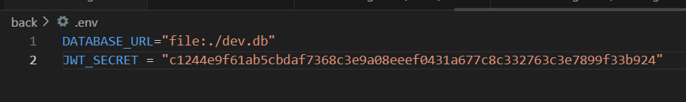

# Asocial

## FAZER Nino

## PEREIRA-ELENGA MAKOUALA Jordy

## TRAN Huu-Nghia

## MONMARCHE Romain

## Description du Projet

Asocial est un réseau social permettant aux utilisateurs de :

- S'inscrire et se connecter.
- Publier des articles.
- Commenter les publications d'autres utilisateurs.
- "Liker" des articles.

Ce projet met en pratique l'utilisation de **GraphQL, Prisma, et Apollo Client**, ainsi que l'intégration de ces technologies dans une application frontend moderne.

---

## Fonctionnalités Clés

### 1. Authentification des Utilisateurs :closed_lock_with_key:

- Inscription et connexion avec validation.
- Gestion des sessions utilisateur avec JWT.

### 2. Gestion des Articles :pencil:

- **CRUD complet** : création, lecture, mise à jour et suppression d'articles.
- Affichage des articles avec **auteur, contenu, commentaires et likes**.

### 3. Interaction avec les Articles :star:

- Ajout et suppression de **commentaires**.
- Système de **like** pour les articles.

### 4. Navigation et Filtrage :mag:

- Page principale affichant les **derniers articles**.
- Filtrage des articles par **auteur** ou **popularité (nombre de likes)**.

### 5. Gestion des Erreurs :construction:

- Redirection automatique en cas d'**accès non autorisé**.
- Gestion des erreurs serveur et client.

---

## Technologies Utilisées :computer:

### Backend (GraphQL + Prisma + Apollo Server)

- **TypeScript** pour le développement backend.
- **Apollo Server** pour GraphQL.
- **Prisma** pour la gestion de la base de données.
- **GraphQL Codegen** pour générer automatiquement les types et les hooks.
- **SQLite** comme base de données, gérée via SQLiteStudio.

### Frontend (React + Apollo Client)

- **React** pour l'interface utilisateur.
- **Apollo Client** pour la gestion des requêtes GraphQL.
- **React Router** pour la navigation.
- **React Toastify** pour les notifications.
- **TailwindCSS** pour le design.

---

## Prérequis

Avant d'installer et d'exécuter le projet, assurez-vous d'avoir :

- **Node.js** installé (v16 ou supérieur).
- **PostgreSQL** installé et configuré.
- **Un gestionnaire de paquets** comme npm ou yarn.

---

## Installation et Lancement du Projet

### Clonez le dépôt

```sh
git clone https://github.com/RoromainM/Asocial.git
cd Asocial
```

### Backend

````sh
# Asocial

## Commandes à lancer dans le back :

```sh
# Installer les dépendances :
npm i

# Récupérer la dernière structure de la BD
npm run prisma migrate dev --name init

# Générer les types
npm run codegen

# Lancer le back
npm run dev

# Lancer Prisma Studio
npm run prisma studio

````

### .env



### Frontend

```sh
cd front
npm install
npm run dev
```

Ouvrez l'URL suivante dans votre navigateur :

```
http://localhost:5173
```

---

## Livrables :package:

- **Un monorepo GitHub** avec :
  - Un dossier `back/` contenant le backend.
  - Un dossier `front/` contenant le frontend.
  - Un `README.md` détaillé pour chaque partie.
- Une **présentation finale** du projet.

---

bonne exploration ! :rocket:
